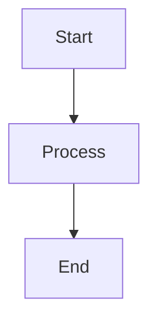

# Basic Flowchart

## Simple LR

```mermaid
graph LR
    A[Start] --> B[Process]
    B --> C[End]
```

## Simple TD

```mermaid
graph TD
    A[Start] --> B[Process]
    B --> C[End]
```

## With Labels

```mermaid
graph LR
    A[Start] -->|"step 1"| B[Process]
    B -->|"step 2"| C[End]
```
