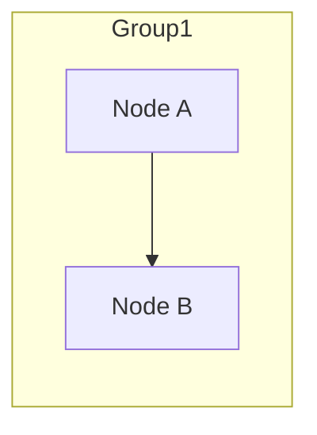
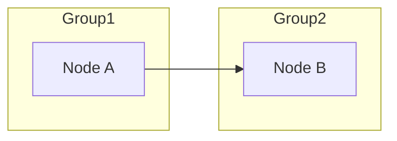
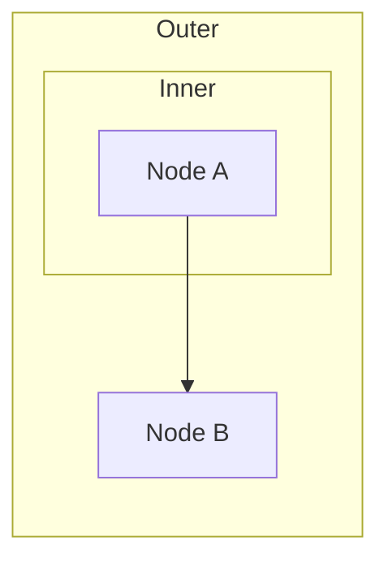
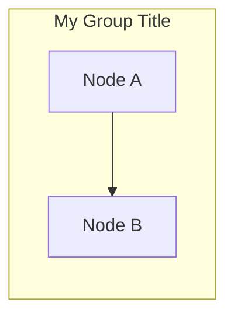

# Subgraphs

## Single Subgraph

```mermaid
graph LR
    subgraph Group1
        A[Node A]
        B[Node B]
    end
    A --> B
```

## Multiple Subgraphs

```mermaid
graph LR
    subgraph Group1
        A[Node A]
    end
    subgraph Group2
        B[Node B]
    end
    A --> B
```

## Nested Subgraphs

```mermaid
graph LR
    subgraph Outer
        subgraph Inner
            A[Node A]
        end
        B[Node B]
    end
    A --> B
```

## Subgraph with Title

```mermaid
graph LR
    subgraph Group1["My Group Title"]
        A[Node A]
        B[Node B]
    end
    A --> B
```
