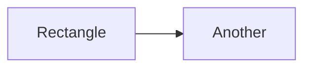
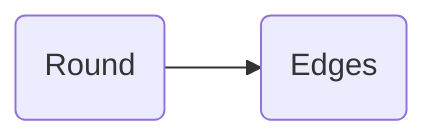
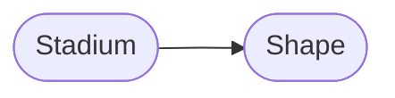
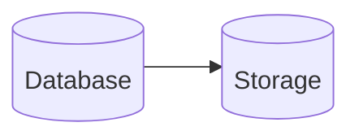
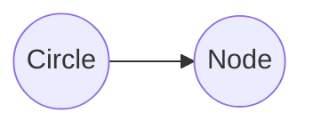
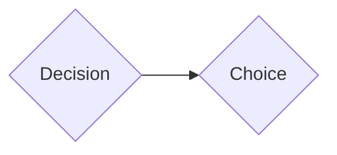
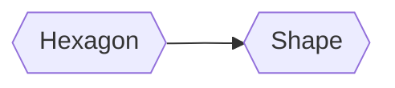
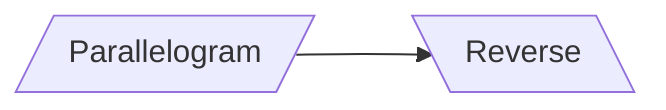
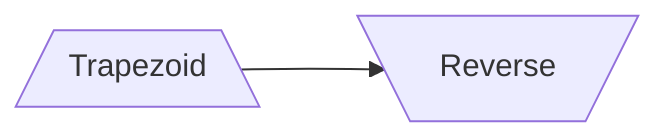

# Node Shapes

## Rectangle (default)

```mermaid
graph LR
    A[Rectangle] --> B[Another]
```

## Round Edges

```mermaid
graph LR
    A(Round) --> B(Edges)
```

## Stadium

```mermaid
graph LR
    A([Stadium]) --> B([Shape])
```

## Cylinder (Database)

```mermaid
graph LR
    A[(Database)] --> B[(Storage)]
```

## Circle

```mermaid
graph LR
    A((Circle)) --> B((Node))
```

## Rhombus (Decision)

```mermaid
graph LR
    A{Decision} --> B{Choice}
```

## Hexagon

```mermaid
graph LR
    A{{Hexagon}} --> B{{Shape}}
```

## Parallelogram

```mermaid
graph LR
    A[/Parallelogram/] --> B[\Reverse\]
```

## Trapezoid

```mermaid
graph LR
    A[/Trapezoid\] --> B[\Reverse/]
```
