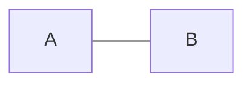
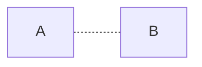
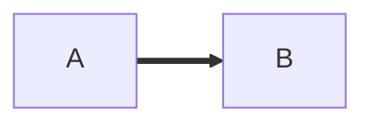
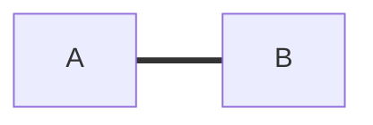
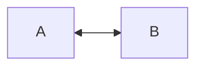
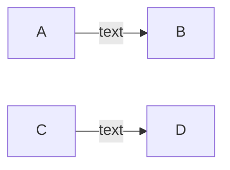

# Edge Types

## Arrow

```mermaid
graph LR
    A --> B
```

## Open Link

```mermaid
graph LR
    A --- B
```

## Dotted Arrow

```mermaid
graph LR
    A -.-> B
```

## Dotted Line

```mermaid
graph LR
    A -.- B
```

## Thick Arrow

```mermaid
graph LR
    A ==> B
```

## Thick Line

```mermaid
graph LR
    A === B
```

## Bidirectional

```mermaid
graph LR
    A <--> B
```

## With Text

```mermaid
graph LR
    A -->|text| B
    C --text--> D
```
