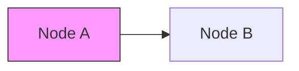
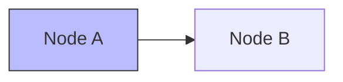
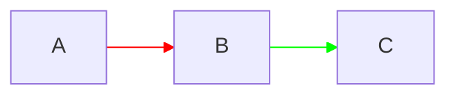

# Styling Features

## classDef

```mermaid
graph LR
    A[Node A]:::highlight --> B[Node B]
    classDef highlight fill:#f9f,stroke:#333
```

## style (inline)

```mermaid
graph LR
    A[Node A] --> B[Node B]
    style A fill:#bbf,stroke:#333
```

## linkStyle

```mermaid
graph LR
    A --> B --> C
    linkStyle 0 stroke:#ff0000
    linkStyle 1 stroke:#00ff00
```

## click

```mermaid
graph LR
    A[Clickable] --> B[Node]
    click A "https://example.com"
```
