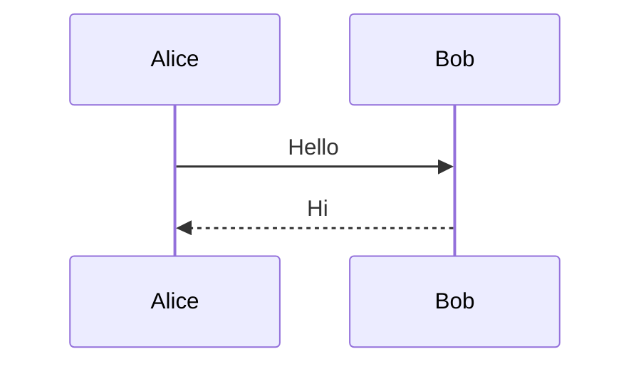
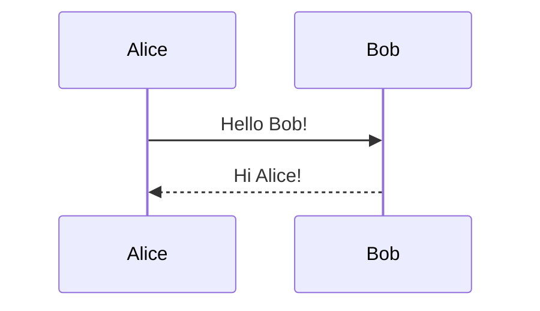
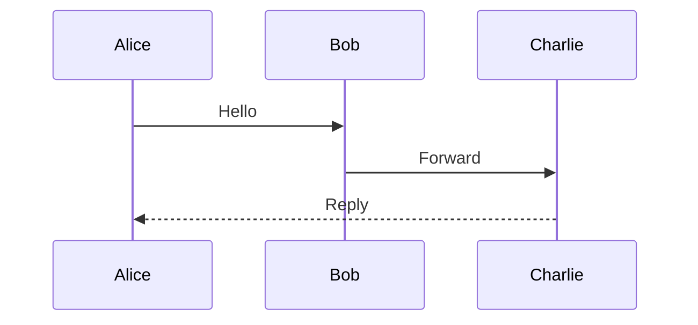
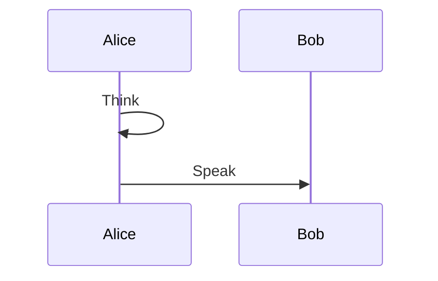

# Basic Sequence Diagrams

## Simple

```mermaid
sequenceDiagram
    Alice->>Bob: Hello
    Bob-->>Alice: Hi
```

## With Participants

```mermaid
sequenceDiagram
    participant A as Alice
    participant B as Bob
    A->>B: Hello Bob!
    B-->>A: Hi Alice!
```

## Multiple Participants

```mermaid
sequenceDiagram
    participant A as Alice
    participant B as Bob
    participant C as Charlie
    A->>B: Hello
    B->>C: Forward
    C-->>A: Reply
```

## Self Message

```mermaid
sequenceDiagram
    Alice->>Alice: Think
    Alice->>Bob: Speak
```
