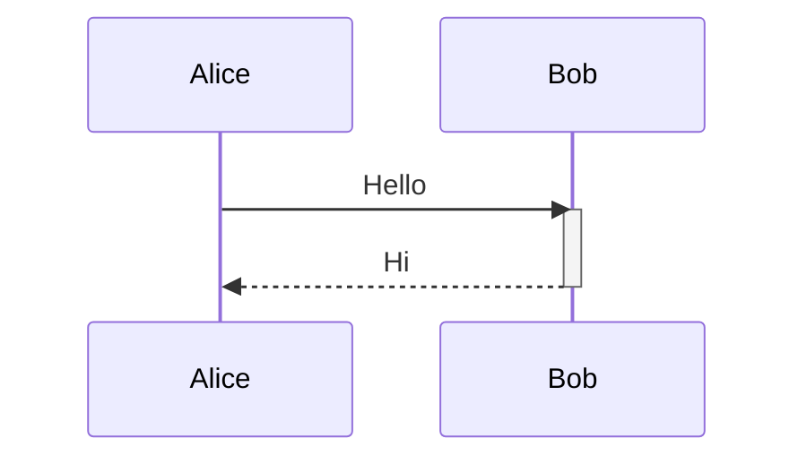
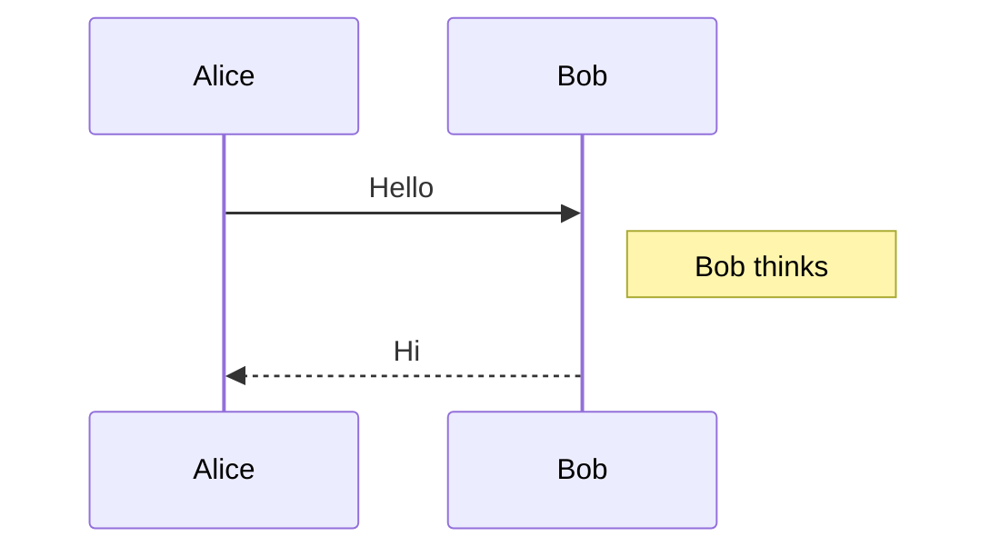
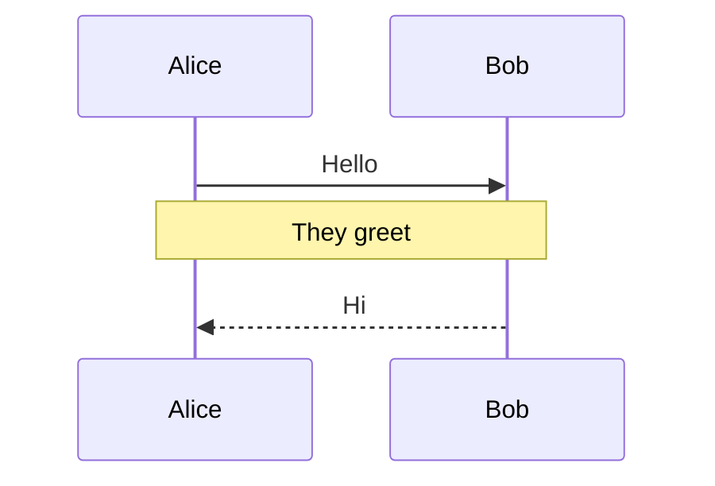
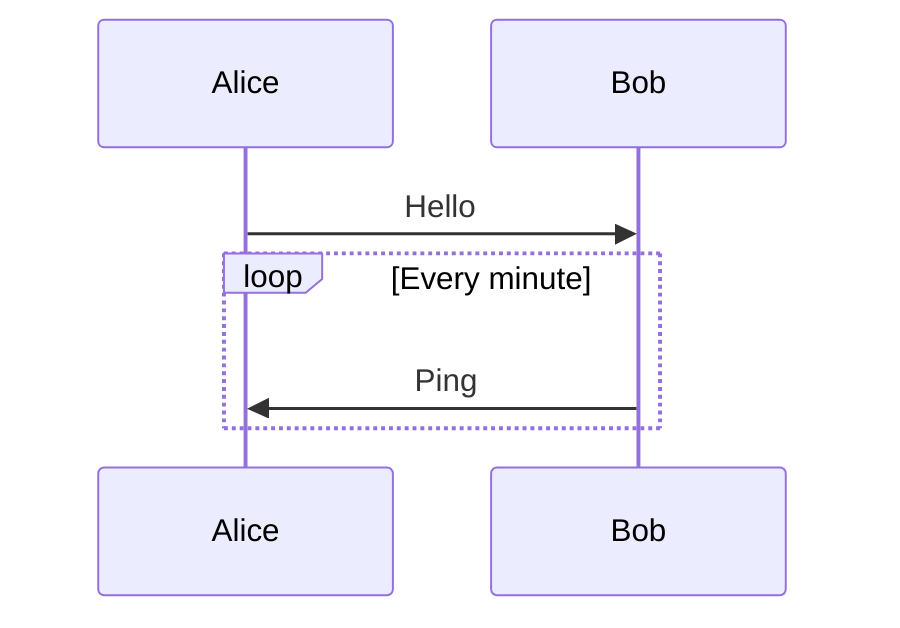
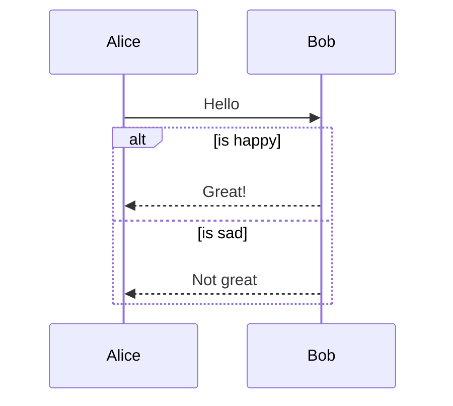
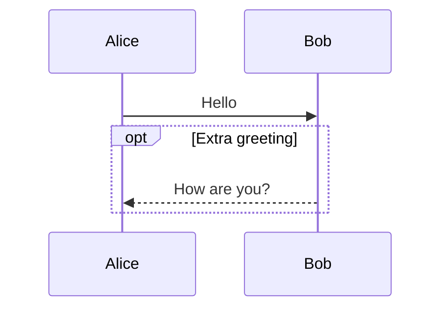
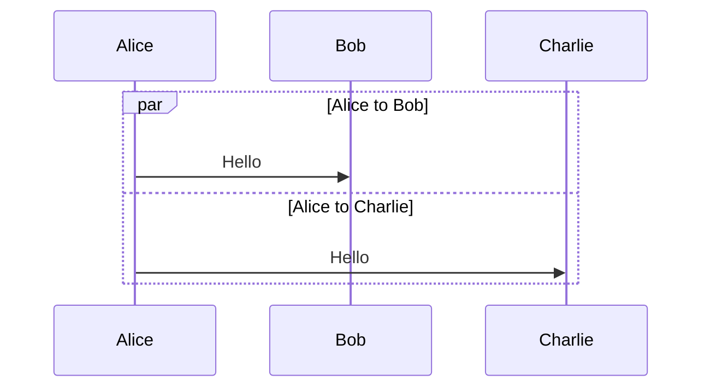
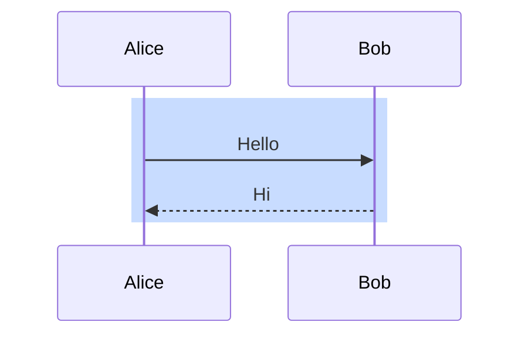
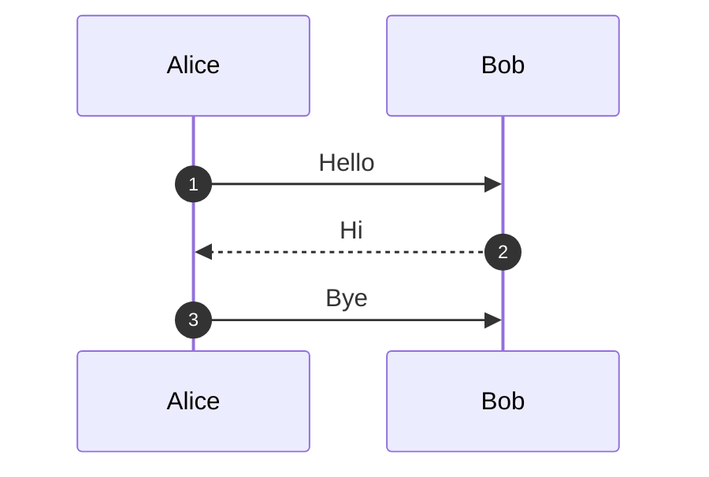

# Advanced Sequence Diagrams

## Activation

```mermaid
sequenceDiagram
    Alice->>Bob: Hello
    activate Bob
    Bob-->>Alice: Hi
    deactivate Bob
```

## Notes

```mermaid
sequenceDiagram
    Alice->>Bob: Hello
    Note right of Bob: Bob thinks
    Bob-->>Alice: Hi
```

## Note over

```mermaid
sequenceDiagram
    Alice->>Bob: Hello
    Note over Alice,Bob: They greet
    Bob-->>Alice: Hi
```

## Loop

```mermaid
sequenceDiagram
    Alice->>Bob: Hello
    loop Every minute
        Bob->>Alice: Ping
    end
```

## Alt (Alternative)

```mermaid
sequenceDiagram
    Alice->>Bob: Hello
    alt is happy
        Bob-->>Alice: Great!
    else is sad
        Bob-->>Alice: Not great
    end
```

## Opt (Optional)

```mermaid
sequenceDiagram
    Alice->>Bob: Hello
    opt Extra greeting
        Bob-->>Alice: How are you?
    end
```

## Par (Parallel)

```mermaid
sequenceDiagram
    par Alice to Bob
        Alice->>Bob: Hello
    and Alice to Charlie
        Alice->>Charlie: Hello
    end
```

## Rect (Background)

```mermaid
sequenceDiagram
    rect rgb(200, 220, 255)
        Alice->>Bob: Hello
        Bob-->>Alice: Hi
    end
```

## Autonumber

```mermaid
sequenceDiagram
    autonumber
    Alice->>Bob: Hello
    Bob-->>Alice: Hi
    Alice->>Bob: Bye
```
