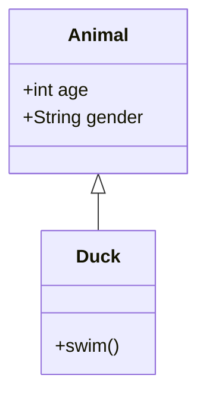
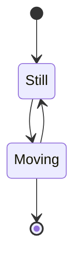
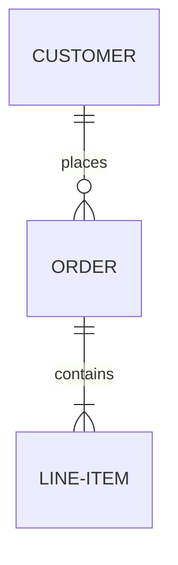
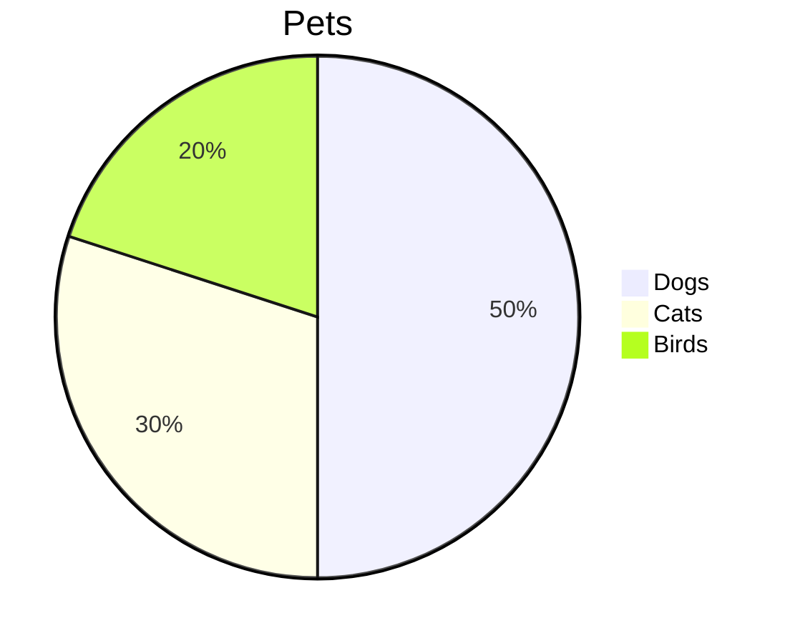
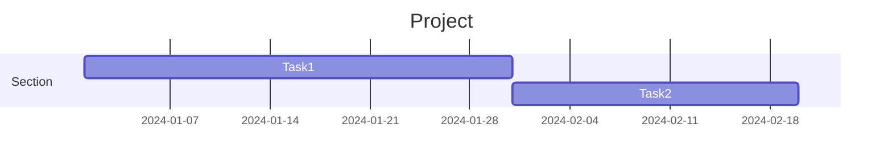
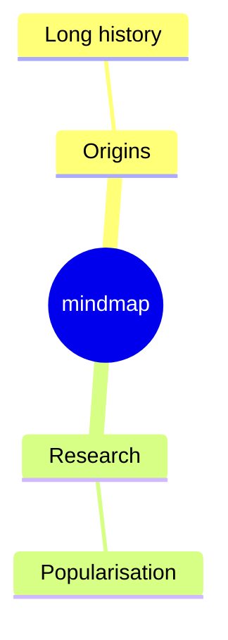
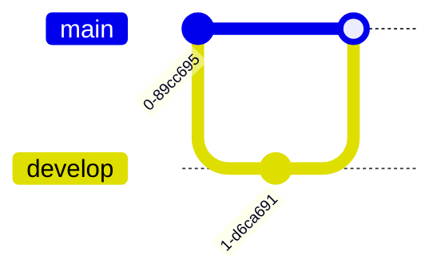

# Other Diagram Types

## Class Diagram

```mermaid
classDiagram
    Animal <|-- Duck
    Animal : +int age
    Animal : +String gender
    Duck : +swim()
```

## State Diagram

```mermaid
stateDiagram-v2
    [*] --> Still
    Still --> Moving
    Moving --> Still
    Moving --> [*]
```

## ER Diagram

```mermaid
erDiagram
    CUSTOMER ||--o{ ORDER : places
    ORDER ||--|{ LINE-ITEM : contains
```

## Pie Chart

```mermaid
pie title Pets
    "Dogs" : 50
    "Cats" : 30
    "Birds" : 20
```

## Gantt Chart

```mermaid
gantt
    title Project
    dateFormat YYYY-MM-DD
    section Section
    Task1 :a1, 2024-01-01, 30d
    Task2 :after a1, 20d
```

## Mindmap

```mermaid
mindmap
    root((mindmap))
        Origins
            Long history
        Research
            Popularisation
```

## Git Graph

```mermaid
gitGraph
    commit
    branch develop
    commit
    checkout main
    merge develop
```
