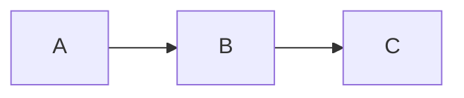
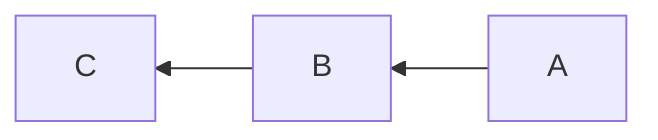
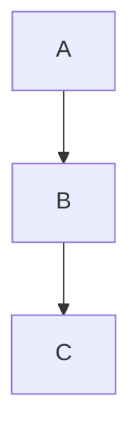
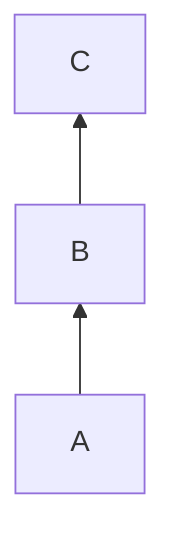
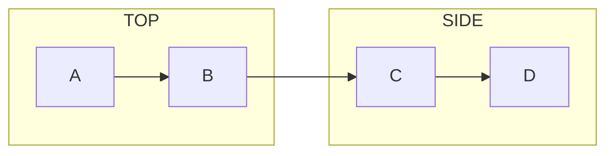

# Direction Tests

## LR (Left to Right)

```mermaid
graph LR
    A --> B --> C
```

## RL (Right to Left)

```mermaid
graph RL
    A --> B --> C
```

## TB (Top to Bottom)

```mermaid
graph TB
    A --> B --> C
```

## BT (Bottom to Top)

```mermaid
graph BT
    A --> B --> C
```

## TD (Top Down = TB)

```mermaid
graph TD
    A --> B --> C
```

## Flowchart LR

```mermaid
flowchart LR
    A --> B --> C
```

## Flowchart TB

```mermaid
flowchart TB
    A --> B --> C
```

## Subgraph Direction

```mermaid
graph LR
    subgraph TOP
        direction TB
        A --> B
    end
    subgraph SIDE
        direction LR
        C --> D
    end
    B --> C
```
