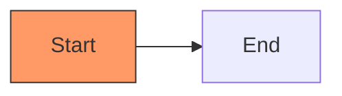
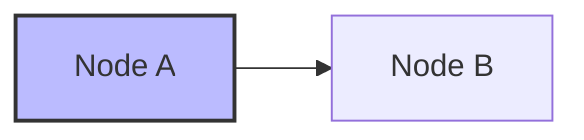
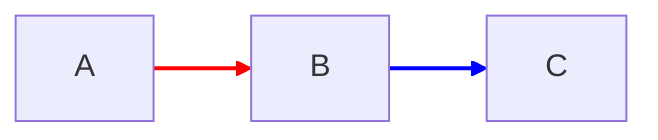
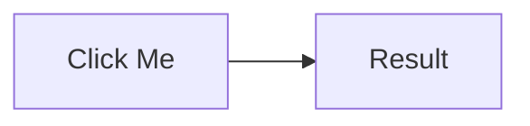
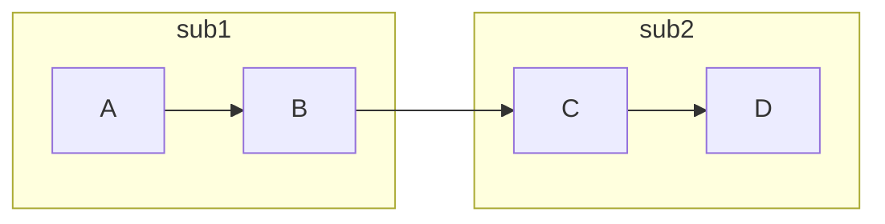
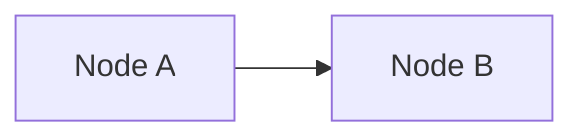
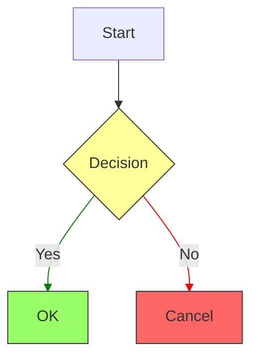

# Styling Directives - Detailed Examples

This shows how mermaid-ascii handles styling directives. In proper mermaid renderers,
these directives style nodes/edges but are not visible. In mermaid-ascii, they appear
as additional nodes in the diagram.

## classDef - Define a CSS class for nodes

**Mermaid code:**
```
graph LR
    A[Start]:::important --> B[End]
    classDef important fill:#f96,stroke:#333
```

**Expected:** A and B connected, A styled with orange fill
**Actual in mermaid-ascii:** "classDef important fill:#f96,stroke:#333" appears as a node



---

## style - Inline style for specific node

**Mermaid code:**
```
graph LR
    A[Node A] --> B[Node B]
    style A fill:#bbf,stroke:#333,stroke-width:2px
```

**Expected:** A and B connected, A has blue fill
**Actual in mermaid-ascii:** "style A fill:#bbf..." appears as a separate node



---

## linkStyle - Style for edges

**Mermaid code:**
```
graph LR
    A --> B --> C
    linkStyle 0 stroke:red,stroke-width:2px
    linkStyle 1 stroke:blue,stroke-width:2px
```

**Expected:** A->B in red, B->C in blue
**Actual in mermaid-ascii:** Each linkStyle line appears as a node



---

## click - Add click handler to node

**Mermaid code:**
```
graph LR
    A[Click Me] --> B[Result]
    click A href "https://example.com"
    click A callback "callbackFunction"
```

**Expected:** A is clickable (in browser), diagram shows A->B
**Actual in mermaid-ascii:** Each click line appears as a node



---

## direction - Set direction within subgraph

**Mermaid code:**
```
graph LR
    subgraph sub1
        direction TB
        A --> B
    end
    subgraph sub2
        direction LR
        C --> D
    end
    B --> C
```

**Expected:** sub1 flows top-bottom, sub2 flows left-right
**Actual in mermaid-ascii:** "direction TB" and "direction LR" appear as nodes inside subgraphs



---

## class - Apply existing class to node

**Mermaid code:**
```
graph LR
    A[Node A] --> B[Node B]
    class A,B someClass
```

**Expected:** Both A and B get someClass styling applied
**Actual in mermaid-ascii:** "class A,B someClass" appears as a node



---

## Combined example - Multiple styling directives



In a proper mermaid renderer, this would show a decision flowchart with colored nodes.
In mermaid-ascii, all the classDef/class/style/linkStyle lines appear as separate nodes.
