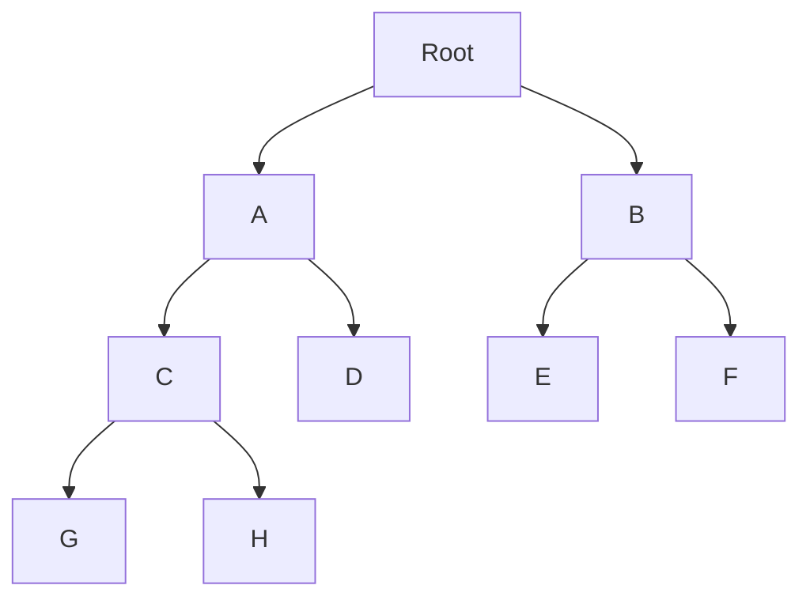
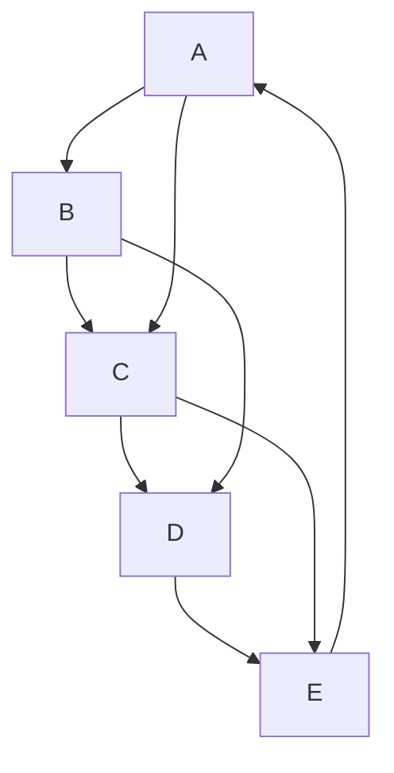
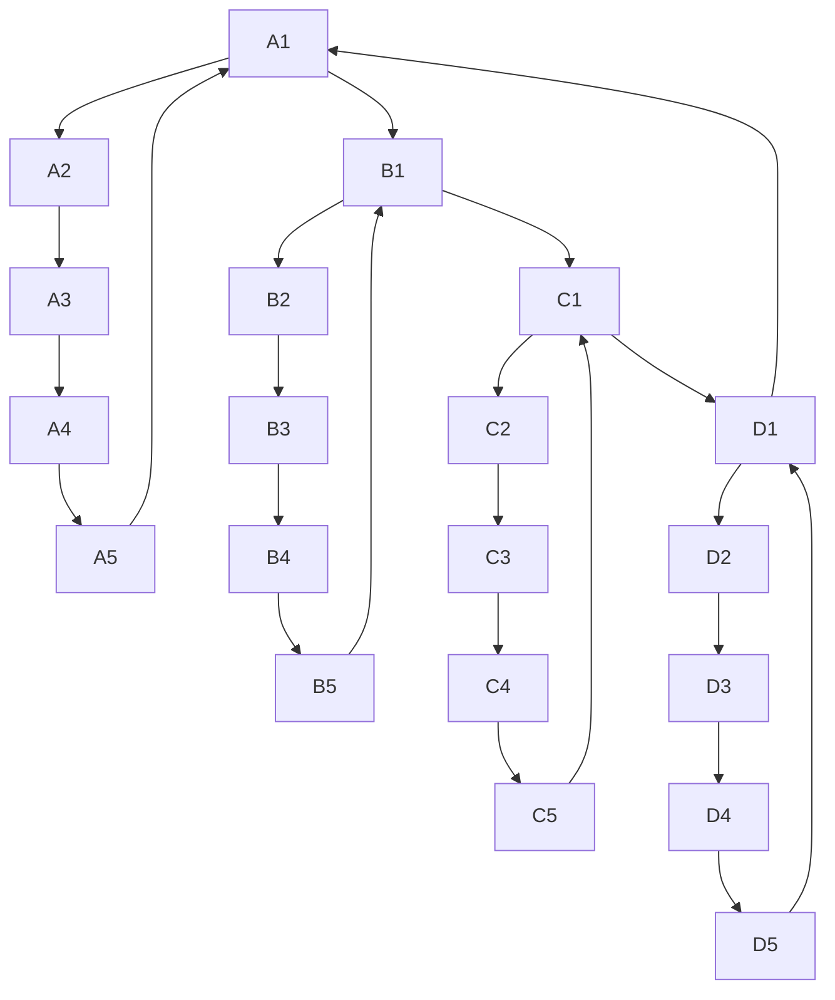
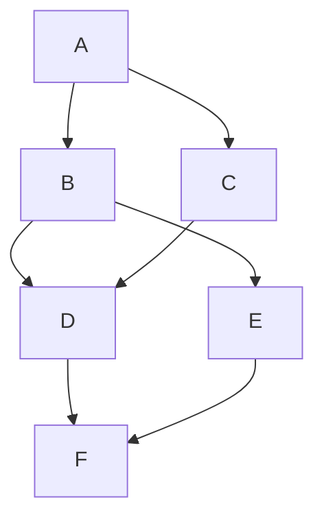
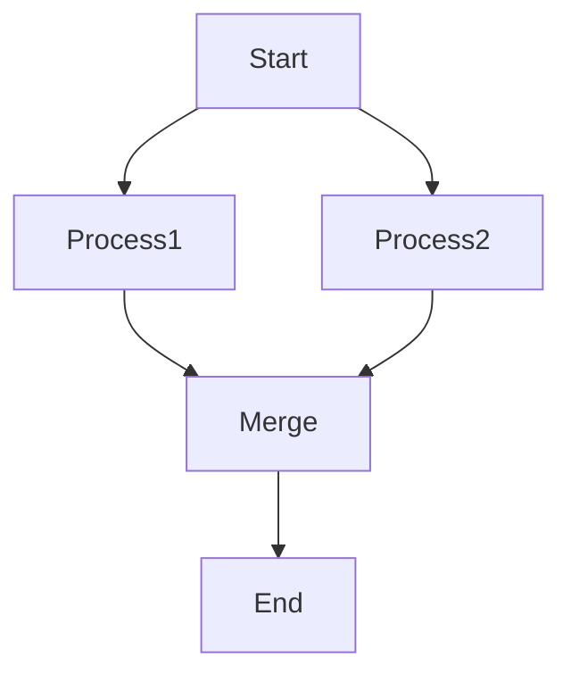

# Algorithm Showcase

Test diagrams designed to trigger each layout algorithm in mercat.
Use `mercat --debug-mermaid examples/algorithm-showcase.md` to verify.

## 1. Reingold-Tilford (Tree Layout)

Conditions: >=5 nodes, is a tree, fits width

## 2. Kamada-Kawai (Force-Directed, Small)

Conditions: Cyclic graph OR >30% edge reversal, <20 nodes

## 3. Stress Majorization (Force-Directed, Medium)

Conditions: Cyclic graph OR >30% edge reversal, 20-50 nodes

## 4. Dominance Drawing

Conditions: <=10 nodes, DAG with reachability structure

## 5. Sugiyama (Default)

Conditions: DAG without heavy cycles (default fallback)

## 6. Large Cyclic (Fruchterman-Reingold)

Conditions: Cyclic graph, >50 nodes

```mermaid
flowchart LR
    N01 --> N02 --> N03 --> N04 --> N05 --> N06 --> N07 --> N08 --> N09 --> N10
    N11 --> N12 --> N13 --> N14 --> N15 --> N16 --> N17 --> N18 --> N19 --> N20
    N21 --> N22 --> N23 --> N24 --> N25 --> N26 --> N27 --> N28 --> N29 --> N30
    N31 --> N32 --> N33 --> N34 --> N35 --> N36 --> N37 --> N38 --> N39 --> N40
    N41 --> N42 --> N43 --> N44 --> N45 --> N46 --> N47 --> N48 --> N49 --> N50
    N50 --> N51 --> N52
    N52 --> N01
    N10 --> N21
    N20 --> N31
    N30 --> N41
    N40 --> N01
```

