# All Mermaid Diagrams

---

# Basic Flowchart

## Simple LR
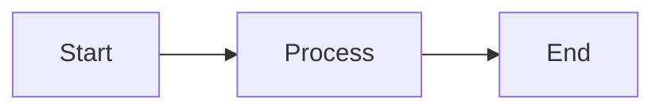

## Simple TD
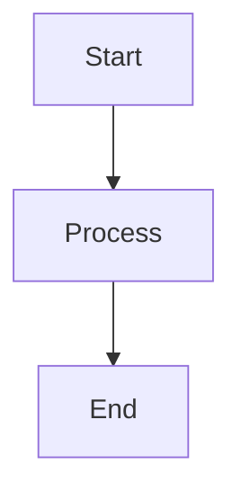

## With Labels
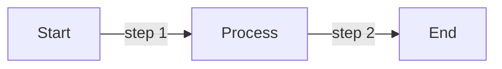

---

# Subgraphs

## Single Subgraph
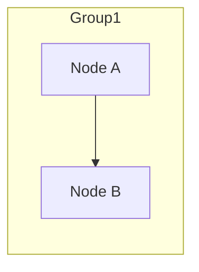

## Multiple Subgraphs
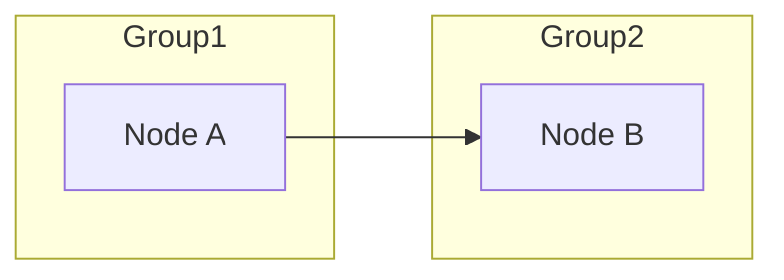

## Nested Subgraphs
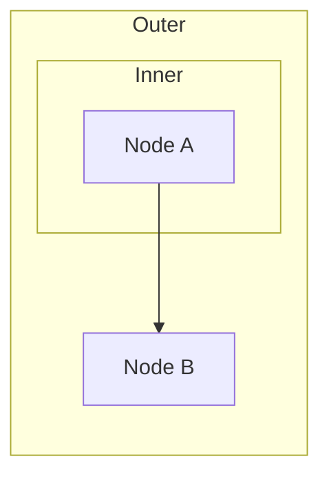

## Subgraph with Title
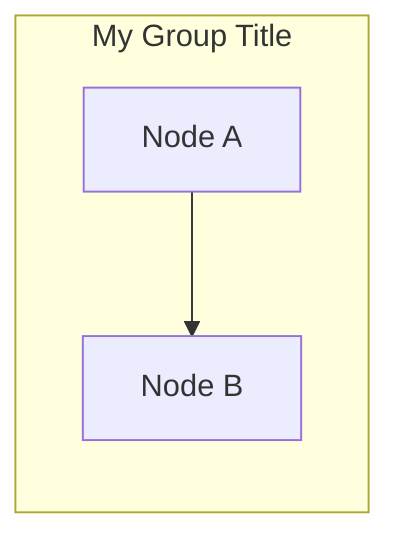

---

# Node Shapes

## Rectangle (default)
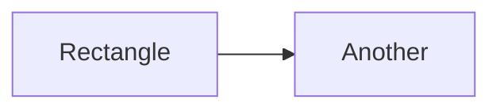

## Round Edges
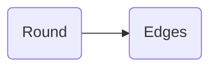

## Stadium
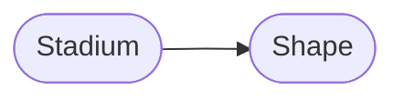

## Cylinder (Database)
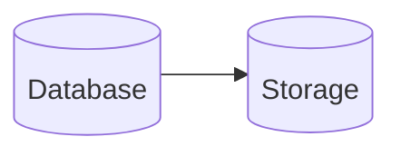

## Circle
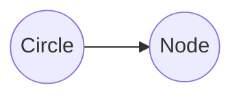

## Rhombus (Decision)
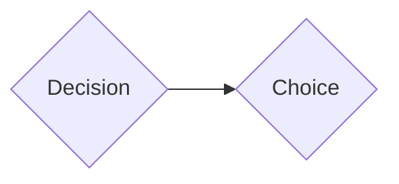

## Hexagon
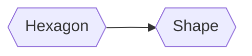

## Parallelogram
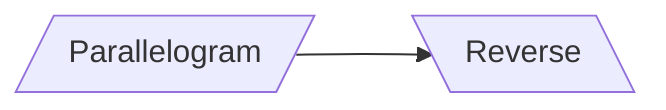

## Trapezoid
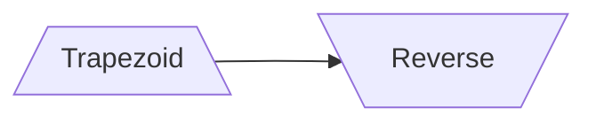

---

# Edge Types

## Arrow


## Open Link
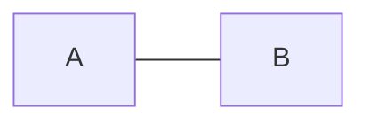

## Dotted Arrow


## Dotted Line
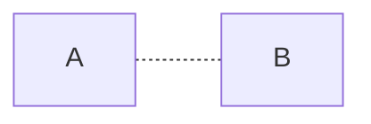

## Thick Arrow
```mermaid
graph LR
    A ==> B
```

## Thick Line
```mermaid
graph LR
    A === B
```

## Bidirectional
```mermaid
graph LR
    A <--> B
```

## With Text
```mermaid
graph LR
    A -->|text| B
    C --text--> D
```

---

# Styling Features

## classDef
```mermaid
graph LR
    A[Node A]:::highlight --> B[Node B]
    classDef highlight fill:#f9f,stroke:#333
```

## style (inline)
```mermaid
graph LR
    A[Node A] --> B[Node B]
    style A fill:#bbf,stroke:#333
```

## linkStyle
```mermaid
graph LR
    A --> B --> C
    linkStyle 0 stroke:#ff0000
    linkStyle 1 stroke:#00ff00
```

## click
```mermaid
graph LR
    A[Clickable] --> B[Node]
    click A "https://example.com"
```

---

# Basic Sequence Diagrams

## Simple
```mermaid
sequenceDiagram
    Alice->>Bob: Hello
    Bob-->>Alice: Hi
```

## With Participants
```mermaid
sequenceDiagram
    participant A as Alice
    participant B as Bob
    A->>B: Hello Bob!
    B-->>A: Hi Alice!
```

## Multiple Participants
```mermaid
sequenceDiagram
    participant A as Alice
    participant B as Bob
    participant C as Charlie
    A->>B: Hello
    B->>C: Forward
    C-->>A: Reply
```

## Self Message
```mermaid
sequenceDiagram
    Alice->>Alice: Think
    Alice->>Bob: Speak
```

---

# Advanced Sequence Diagrams

## Activation
```mermaid
sequenceDiagram
    Alice->>Bob: Hello
    activate Bob
    Bob-->>Alice: Hi
    deactivate Bob
```

## Notes
```mermaid
sequenceDiagram
    Alice->>Bob: Hello
    Note right of Bob: Bob thinks
    Bob-->>Alice: Hi
```

## Note over
```mermaid
sequenceDiagram
    Alice->>Bob: Hello
    Note over Alice,Bob: They greet
    Bob-->>Alice: Hi
```

## Loop
```mermaid
sequenceDiagram
    Alice->>Bob: Hello
    loop Every minute
        Bob->>Alice: Ping
    end
```

## Alt (Alternative)
```mermaid
sequenceDiagram
    Alice->>Bob: Hello
    alt is happy
        Bob-->>Alice: Great!
    else is sad
        Bob-->>Alice: Not great
    end
```

## Opt (Optional)
```mermaid
sequenceDiagram
    Alice->>Bob: Hello
    opt Extra greeting
        Bob-->>Alice: How are you?
    end
```

## Par (Parallel)
```mermaid
sequenceDiagram
    par Alice to Bob
        Alice->>Bob: Hello
    and Alice to Charlie
        Alice->>Charlie: Hello
    end
```

## Rect (Background)
```mermaid
sequenceDiagram
    rect rgb(200, 220, 255)
        Alice->>Bob: Hello
        Bob-->>Alice: Hi
    end
```

## Autonumber
```mermaid
sequenceDiagram
    autonumber
    Alice->>Bob: Hello
    Bob-->>Alice: Hi
    Alice->>Bob: Bye
```

---

# Other Diagram Types

## Class Diagram
```mermaid
classDiagram
    Animal <|-- Duck
    Animal : +int age
    Animal : +String gender
    Duck : +swim()
```

## State Diagram
```mermaid
stateDiagram-v2
  [*] --> Idle
  Idle --> Active : start
  Active --> Idle : cancel
  Active --> Done : complete
  Done --> [*]
```


```mermaid
stateDiagram-v2
    [*] --> Still
    Still --> [*]

    Still --> Moving
    Moving --> Still
    Moving --> Crash
    Crash --> [*]
```

## ER Diagram
```mermaid
erDiagram
    CUSTOMER ||--o{ ORDER : places
    ORDER ||--|{ LINE-ITEM : contains
```

## Pie Chart
```mermaid
pie title Pets
    "Dogs" : 50
    "Cats" : 30
    "Birds" : 20
```

## Gantt Chart
```mermaid
gantt
    title Project
    dateFormat YYYY-MM-DD
    section Section
    Task1 :a1, 2024-01-01, 30d
    Task2 :after a1, 20d
```

## Mindmap
```mermaid
mindmap
    root((mindmap))
        Origins
            Long history
        Research
            Popularisation
```

## Git Graph
```mermaid
gitGraph
    commit
    branch develop
    commit
    checkout main
    merge develop
```

---

# Directions

## LR (Left to Right)
```mermaid
graph LR
    A --> B --> C
```

## RL (Right to Left)
```mermaid
graph RL
    A --> B --> C
```

## TB (Top to Bottom)
```mermaid
graph TB
    A --> B --> C
```

## BT (Bottom to Top)
```mermaid
graph BT
    A --> B --> C
```

## TD (Top Down = TB)
```mermaid
graph TD
    A --> B --> C
```

## Flowchart LR
```mermaid
flowchart LR
    A --> B --> C
```

## Flowchart TB
```mermaid
flowchart TB
    A --> B --> C
```

## Subgraph Direction
```mermaid
graph LR
    subgraph TOP
        direction TB
        A --> B
    end
    subgraph SIDE
        direction LR
        C --> D
    end
    B --> C
```

---

# Styling Directives - Detailed

## classDef - Define a CSS class for nodes
```mermaid
graph LR
    A[Start]:::important --> B[End]
    classDef important fill:#f96,stroke:#333
```

## style - Inline style for specific node
```mermaid
graph LR
    A[Node A] --> B[Node B]
    style A fill:#bbf,stroke:#333,stroke-width:2px
```

## linkStyle - Style for edges
```mermaid
graph LR
    A --> B --> C
    linkStyle 0 stroke:red,stroke-width:2px
    linkStyle 1 stroke:blue,stroke-width:2px
```

## click - Add click handler to node
```mermaid
graph LR
    A[Click Me] --> B[Result]
    click A href "https://example.com"
```

## direction - Set direction within subgraph
```mermaid
graph LR
    subgraph sub1
        direction TB
        A --> B
    end
    subgraph sub2
        direction LR
        C --> D
    end
    B --> C
```

## class - Apply existing class to node
```mermaid
graph LR
    A[Node A] --> B[Node B]
    class A,B someClass
```

## Combined - Multiple styling directives
```mermaid
graph TD
    A[Start] --> B{Decision}
    B -->|Yes| C[OK]
    B -->|No| D[Cancel]

    classDef green fill:#9f6,stroke:#333
    classDef red fill:#f66,stroke:#333
    class C green
    class D red
    style B fill:#ff9,stroke:#333
    linkStyle 1 stroke:green
    linkStyle 2 stroke:red
```

# most complex examples

```mermaid
flowchart TB
    subgraph Browser["Browser (localhost)"]
        FE["Neo Frontend<br/>:9001"]
        LP["OIDC Login Page<br/>:9002/interaction/*"]
    end

    subgraph Docker["Docker Compose"]
        OIDC["OIDC Provider<br/>:9002"]
        BE["Neo Backend<br/>:9000"]
        PG[("PostgreSQL<br/>:5433")]
    end

    subgraph Files["Configuration Files"]
        USERS["users.yaml"]
        JWKS["jwks.json"]
    end

    FE -->|"1. Auth redirect"| OIDC
    OIDC -->|"2. Show login"| LP
    LP -->|"3. Submit credentials"| OIDC
    OIDC -->|"4. Validate against"| USERS
    OIDC -->|"5. Redirect with code"| FE
    FE -->|"6. Exchange code for tokens"| OIDC
    OIDC -->|"7. Sign tokens with"| JWKS
    FE -->|"8. API request + Bearer token"| BE
    BE -->|"9. Fetch JWKS"| OIDC
    BE -->|"10. Validate token"| BE
    BE --> PG
```

### Authentication Flow Sequence

```mermaid
sequenceDiagram
    participant U as User
    participant F as Frontend :9001
    participant O as OIDC Provider :9002
    participant B as Backend :9000

    U->>F: Visit protected route
    F->>F: Check auth state (none)
    F->>O: Redirect to /authorize<br/>(with PKCE code_challenge)
    O->>U: Show login page
    U->>O: Submit credentials
    O->>O: Validate against users.yaml
    O->>F: Redirect with authorization code
    F->>O: POST /token<br/>(code + code_verifier)
    O->>O: Validate PKCE
    O->>O: Generate tokens (sign with JWKS)
    O->>F: Return access_token + id_token + refresh_token
    F->>F: Store tokens, update auth state
    F->>U: Render protected content

    U->>F: Click action requiring API
    F->>B: API request + Bearer token
    B->>O: Fetch /.well-known/jwks.json
    B->>B: Validate token signature
    B->>B: Extract tenant_id, permissions
    B->>F: API response
    F->>U: Update UI
```

### Component Relationships

```mermaid
graph LR
    subgraph oidc-provider/
        INDEX[src/index.ts<br/>Entry point]
        PROV[src/provider.ts<br/>Provider config]
        CFG[src/config/]
        ADAPT[src/adapters/account.ts]
        CLAIMS[src/claims/auth0-claims.ts]
        INTER[src/interactions/]
        VIEWS[views/*.ejs]
        DATA[data/users.yaml]
    end

    INDEX --> PROV
    PROV --> CFG
    PROV --> ADAPT
    PROV --> CLAIMS
    PROV --> INTER
    INTER --> VIEWS
    ADAPT --> DATA

    subgraph frontend/
        AUTH[contexts/auth-context.tsx]
        ROUTES[routes/_authenticated/]
    end

    AUTH -.->|OIDC flow| PROV

    subgraph backend/
        COMPOSE[docker-compose.yaml]
        VALID[JWT validation]
    end

    COMPOSE -->|runs| INDEX
    VALID -.->|fetch JWKS| PROV
```

