# Expanded Test Cases for Mermaid Verification

These test cases target specific gaps found in the initial verification report.

---

# 1. TD/BT Vertical Routing Tests

## 1.1 Basic TD Chain (3 nodes)
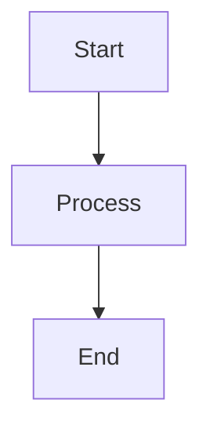

## 1.2 Long TD Chain (5 nodes)
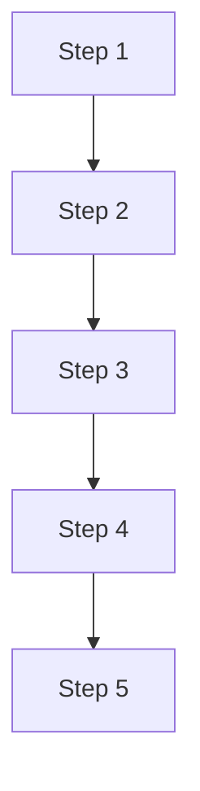

## 1.3 Wide Nodes in TD
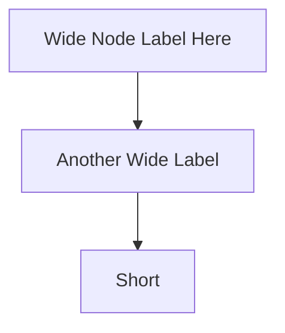

## 1.4 BT Direction (Bottom to Top)
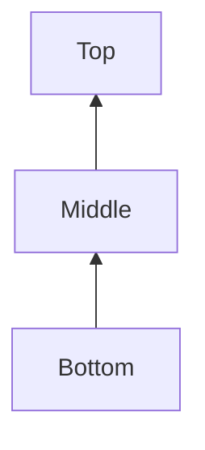

## 1.5 TD with Branching
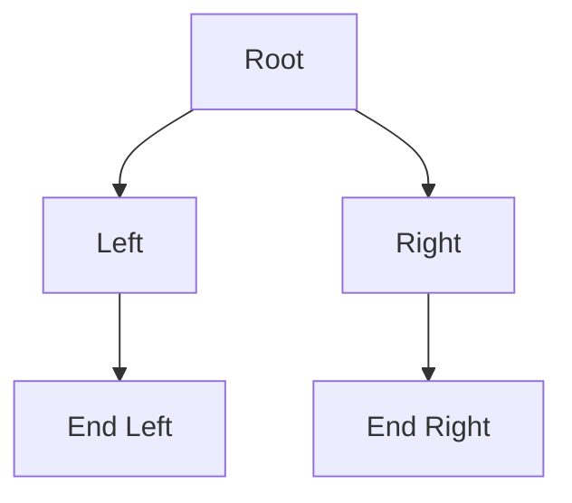

---

# 2. Cyclic Graph Tests (Back-Edge Verification)

## 2.1 Simple 3-Node Cycle
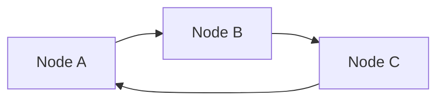

## 2.2 Simple TD Cycle
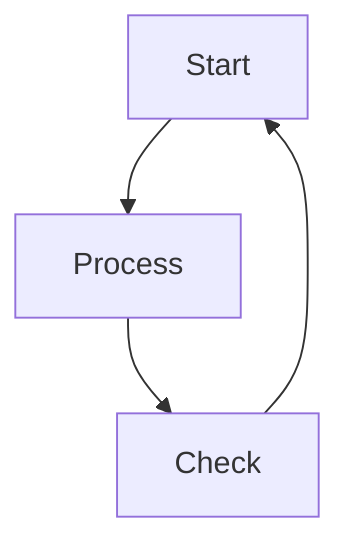

## 2.3 Self-Loop
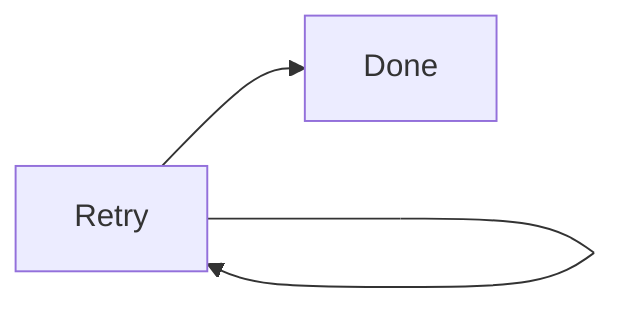

## 2.4 Multi-Cycle Graph
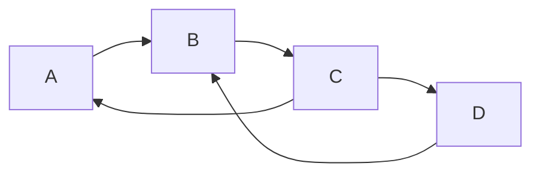

## 2.5 Diamond with Back-Edge
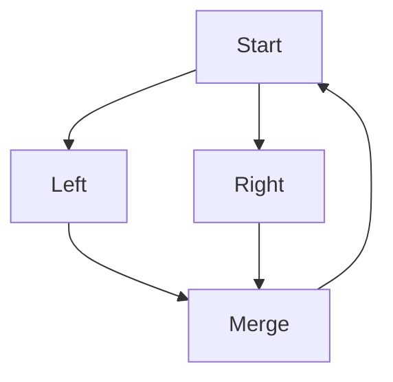

---

# 3. Nested Subgraph Tests

## 3.1 Two-Level Nesting
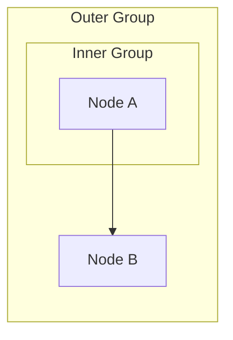

## 3.2 Three-Level Nesting
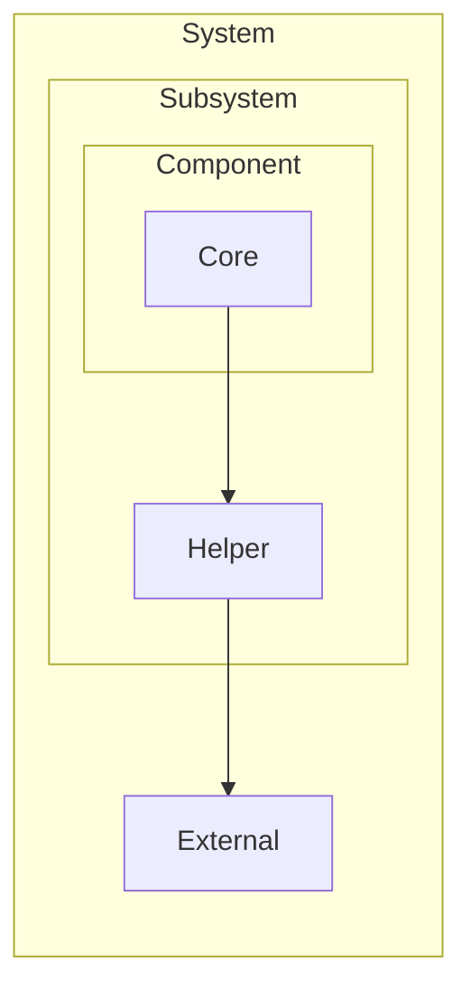

## 3.3 Multiple Siblings at Same Level
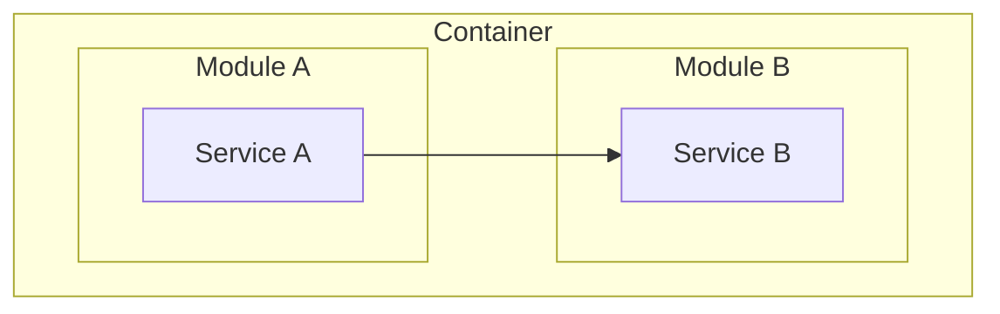

## 3.4 Subgraph with Long Title
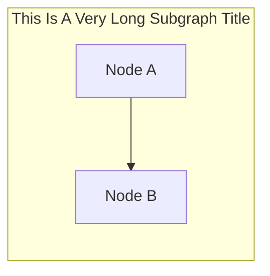

---

# 4. Long Label Tests

## 4.1 Single Long Label (50+ chars)
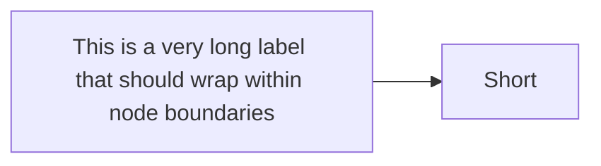

## 4.2 Multiple Long Labels
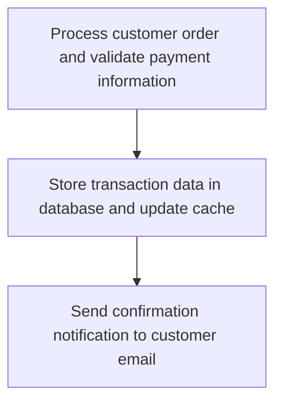

## 4.3 Long Edge Label
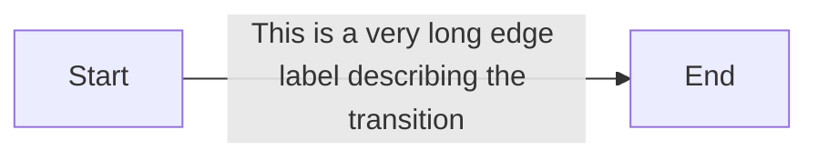

## 4.4 Mixed Long and Short
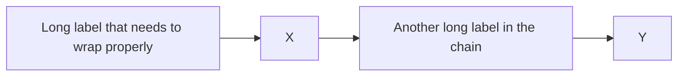

---

# 5. Dense Graph Tests

## 5.1 Ten-Node Chain
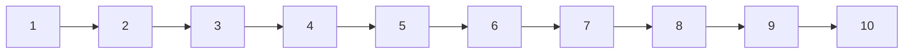

## 5.2 Tree with Multiple Branches
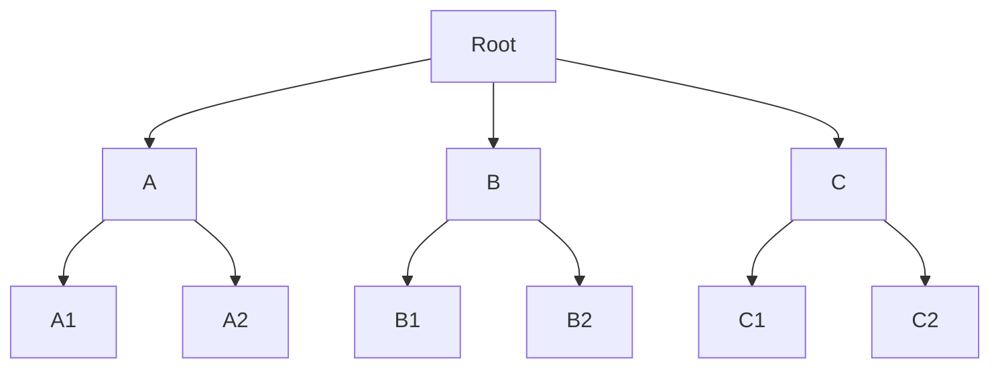

## 5.3 Grid Structure (3x3)
```mermaid
graph LR
    A1[1] --> A2[2] --> A3[3]
    B1[4] --> B2[5] --> B3[6]
    C1[7] --> C2[8] --> C3[9]
    A1 --> B1 --> C1
    A2 --> B2 --> C2
    A3 --> B3 --> C3
```

## 5.4 Fully Connected (5 nodes)
```mermaid
graph LR
    A[A] --> B[B]
    A --> C[C]
    A --> D[D]
    A --> E[E]
    B --> C
    B --> D
    B --> E
    C --> D
    C --> E
    D --> E
```

---

# 6. Width Fitting Stress Tests

## 6.1 Wide LR (Force Label Wrap at Narrow Width)
```mermaid
graph LR
    A["Input Processor"] --> B["Data Validator"] --> C["Storage Handler"] --> D["Output Generator"]
```

## 6.2 Very Wide with Subgraphs
```mermaid
graph LR
    subgraph Frontend["Frontend Layer"]
        A["Web Server"]
        B["Load Balancer"]
    end
    subgraph Backend["Backend Layer"]
        C["API Gateway"]
        D["Service Mesh"]
    end
    subgraph Data["Data Layer"]
        E["Database"]
        F["Cache"]
    end
    A --> C
    B --> C
    C --> E
    D --> F
```

## 6.3 Complex TD (Force Direction Switch)
```mermaid
graph TD
    A["Authentication Service"] --> B["Authorization Check"]
    B --> C["Token Validation"]
    C --> D["Permission Lookup"]
    D --> E["Access Grant"]
    E --> F["Audit Log"]
```

---

# 7. Edge Style Variations

## 7.1 All Edge Types Together
```mermaid
graph LR
    A[A] --> B[B]
    B --- C[C]
    C -.-> D[D]
    D ==> E[E]
    E <--> F[F]
```

## 7.2 Mixed Styles with Labels
```mermaid
graph LR
    A[Start] -->|solid| B[Mid]
    B -.->|dotted| C[Next]
    C ==>|thick| D[End]
```

---

# 8. Complex Combined Test

## 8.1 Full Feature Test
```mermaid
graph TD
    subgraph Input["Input Layer"]
        A["Data Source"]
        B["Parser"]
    end
    subgraph Process["Processing Layer"]
        subgraph Validate["Validation"]
            C["Schema Check"]
            D["Data Clean"]
        end
        E["Transform"]
    end
    subgraph Output["Output Layer"]
        F["Writer"]
        G["Logger"]
    end
    
    A --> B
    B --> C
    C --> D
    D --> E
    E --> F
    E --> G
    G -.-> A
```
